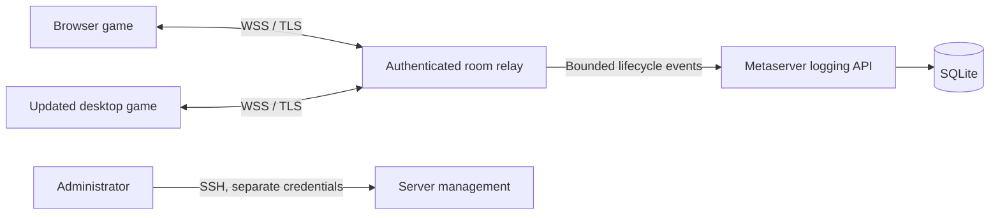

# Secure browser multiplayer proposal

Status: investigation/proposal, 2026-09-12. Not implemented or deployed.
The browser FPS investigation is deferred at Stefan's request; no FPS source
changes were made. This proposal interprets the supplied SSH/I/O concern as
preserving secure administration and explicitly controlling network ingress.
SSH as a required player transport would be a separate requirement.

## Verified starting point

- `src/Network/NetworkManager.cpp:45` constructs an ENet UDP host with two
  channels, then LAN discovery, MetaServerClient and UPnP services. Internet
  hosting uses UPnP/STUN and metaserver announcements.
- `NetworkManager::handlePacket` processes ENet packets. CONNECT/DISCONNECT
  messages identify peers by IP/port; CLIENTSTATS derives identity from an
  address hash. These must become transport-independent logical identities.
- `MetaServerClient.cpp:83` starts an SDL thread. Browser match analytics already
  bypass this with asynchronous Fetch, but lobby discovery/registration do not.
- The browser build has no enabled pthread transport or secure multiplayer
  relay. Enabling a menu button alone cannot make UDP work in a browser.
- `web/.htaccess` restricts network destinations through CSP. Add the exact WSS
  relay origin explicitly rather than relaxing the policy to arbitrary hosts.
- The website's `deploy/bootstrap-secure-deploy.sh` provisions an SSH deployment
  user with a restricted authorized key and an Apache HTTPS service. These are
  source configuration observations, not a fresh audit of the live machine.

## Recommended transport

Use a room-scoped WSS relay for browser/browser and updated desktop/browser
games. Preserve native ENet for existing desktop LAN/direct Internet games.

The relay routes game messages, not operating-system socket calls. Clients
cannot choose arbitrary destination IPs, ports, URLs, filesystem paths or shell
commands. Both endpoint types connect outbound on HTTPS port 443; no router
port forwarding is needed for relay rooms. A native update is required to join
these rooms. Old clients continue using their existing transport; relay rooms
must be advertised through a capability-aware endpoint that old clients do not
mistake for UDP hosts.

Introduce a transport interface for connect/disconnect/send/poll events with
logical peer IDs and channel IDs. Retain binary command serialization and the
deterministic simulation. Relay envelopes carry protocol version, room ID,
destination peer, channel and sequence; the server assigns sender identity from
the authenticated connection rather than trusting an envelope's sender field.
An opaque protocol channel field does not recreate ENet's independent delivery
on one TCP stream. Keep large map/mod transfers off the gameplay socket.

Use asynchronous Fetch for room discovery/tickets and queued WebSocket events
drained by the game loop. Never run arbitrary network callbacks reentrantly
inside a simulation tick. Bound both receive queues and `bufferedAmount`/
outgoing queues; disconnect or pause on overload instead of dropping lockstep
commands and desynchronizing clients.

WebSocket/TCP can stall behind a lost packet. Measure this under latency/loss
before deciding whether a later WebRTC data-channel transport is necessary.
WebRTC would also need signaling, native support and TURN deployment/credentials;
it is not a drop-in replacement for ENet.

## Where I/O is checked

1. **HTTPS ticket issuance:** create a guest session or authenticated account
   session and a short-lived, single-use room admission ticket. Guest admission
   identifies a session, not a verified human. Enforce room policy, invitation
   access, slots and creation/join rate limits here. Use maintained crypto and
   session libraries; do not embed shared secrets in WASM/JavaScript.
2. **WSS ingress:** verify TLS and exact allowed browser Origin, authenticate
   before accepting gameplay messages, enforce ticket expiry/reuse prevention
   and room/role binding. Origin is defense in depth, not authentication: native
   clients can forge it. Avoid putting credentials in logged query strings.
3. **Relay routing:** authorize every message against room membership, phase,
   sender role and recipient. Only the designated host can start a match, change
   a path budget or send host-only control messages. Apply byte/message/rate,
   connection and idle limits before forwarding. Reject cross-room messages.
4. **Client packet parsing:** validate lengths with overflow-safe subtraction,
   bounded counts/allocations, allowed packet types/enums, finite numeric values,
   command ownership and valid tick windows before constructing game objects or
   invoking callbacks. Apply these rules to native clients too. TLS does not
   make another player trustworthy.
5. **Content and persistence:** initially use matching, bundled content. Before
   enabling custom transfers, require size/hash verification, safe paths and
   decompression limits. Untrusted peer content must not replace scripts or
   executables. Write bounded, parameterized lifecycle records through an API;
   do not expose SQLite or mount the production database in the relay.

Specific audit targets: STARTGAME currently invokes its callback directly;
SETPATHBUDGET checks local host/client role but not explicitly that the sender
is the designated host in that handler. CONNECT can direct a client to another
address. ENetPacketIStream has bounds checks, but they use addition and should
be audited for wasm32 overflow and collection allocation limits. These are
source-level hardening targets, not claims of demonstrated remote exploits.

The relay should run as a dedicated unprivileged service with resource quotas,
minimal filesystem access, restricted egress and no deploy/SSH keys. TLS can
terminate at the reverse proxy with a loopback-only backend; a remote backend
requires authenticated encrypted transport as well. Existing SSH administration
remains separate. An SSH tunnel does not replace player authentication, message
validation or TLS for browser connections.

## Compatibility and verification gates

- Separate relay protocol/capability negotiation from game protocol/content
  compatibility. Reject mismatches before joining simulation.
- Preserve old metaserver responses. Add relay-capable discovery and optional
  `transport`/room/session associations without changing legacy row meanings.
  Existing `client_runtime` marks the reporter, not every participant in a mixed
  match. Record per-participant runtimes and server-observed transport for mixed
  games; keep client-reported fields explicitly untrusted.
- Log join/leave, versions, disconnect reasons, validation/rate-limit failures,
  queue pressure and latency. Do not log tickets, keys or full command streams
  by default. Minimize retained IP data and specify retention.
- Prove browser/browser and browser/native state hashes agree for identical
  commands across long skirmish/co-op sessions and save/load boundaries.
- Test forged host commands, cross-room routing, expired/reused tickets, foreign
  origins, oversized/truncated packets, wasm32 length overflow, abusive clients,
  stalled receivers, reconnect attempts, tab suspension and relay restart.
- Lockstep is sensitive to browser throttling and the existing FPS issue. Define
  visible pause/timeout/disconnect behavior; never silently omit a slow player's
  commands. Persistent performance problems remain a separate task.
- An authenticated relay protects access and routing; it is not an authoritative
  game simulation or a complete anti-cheat system. Strong competitive integrity
  would require additional server-side simulation/validation.

Suggested order: extract/test transport and packet validation; build a private
two-browser room prototype; add native relay support and cross-platform tests;
then harden/deploy the relay and expose capability-aware public discovery.
Do not publicly deploy the generic Emscripten POSIX socket proxy as a shortcut.

## References

- [Emscripten networking](https://emscripten.org/docs/porting/networking.html):
  browser socket constraints, asynchronous WebSockets, WebRTC and POSIX proxy
  limitations. The full proxy is intended mainly for testing/debugging, adds
  overhead, requires pthreads, and lacks select/poll support documented there.
- [OWASP WebSocket security](https://cheatsheetseries.owasp.org/cheatsheets/WebSocket_Security_Cheat_Sheet.html):
  authentication, Origin validation, message authorization, limits and logging.
